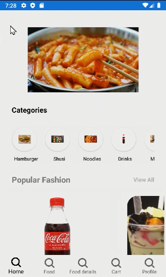
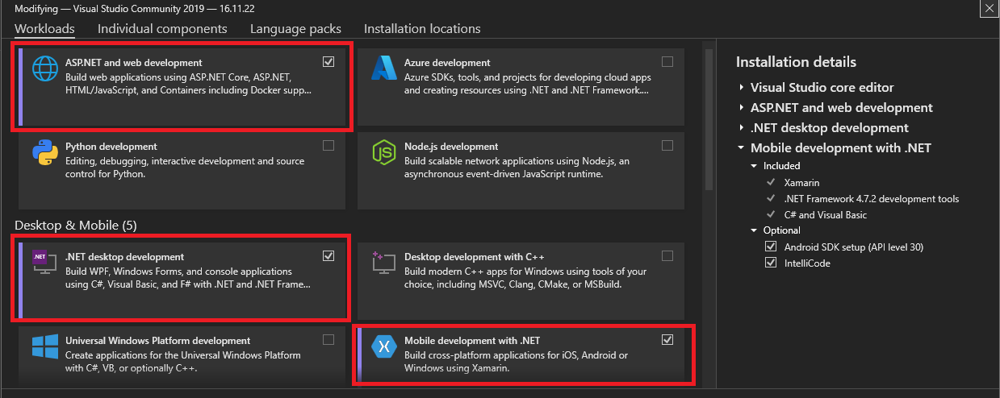
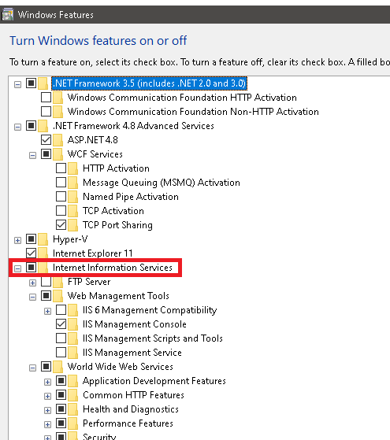

# Food ordering app

This is a Xamarin project from school

## Table of contents

- [Overview](#overview)
  - [The assignment](#the-assignment)
  - [Screenshot](#screenshot)
  - [Links](#links)
  - [How to run FoodOrderingApp locally](#how-to-run-foodorderingapp-locally)
- [My process](#my-process)
  - [Built with](#built-with)
  - [Continued development](#continued-development)
  - [Self assessment](#self-assessment)
- [Author](#author)
- [Acknowledgments](#acknowledgments)

## Overview

### The assignment

Users should be able to:

- Sign up/sign in
- See foods gallery
- Add foods to cart
- Order food

### Screenshot

### Links

- Solution URL: [My code](https://github.com/Binh2/FoodOrderingApp)
- Demo: 

https://youtu.be/WaRPJN_cQ7w

If the video is not rendered then [check out this video](https://youtu.be/WaRPJN_cQ7w)

## How to run FoodOrderingApp locally

### Setup

- Download Visual Studio Code and install ASP.NET, .NET and mobile development with .NET

- Download [SQL Server](https://www.microsoft.com/en-IN/sql-server/sql-server-downloads) and [SSMS](https://learn.microsoft.com/en-us/sql/ssms/download-sql-server-management-studio-ssms-19?view=sql-server-ver16). Then run the installer SQL server first and SSMS second.
- Turn on Internet Infomation Services feature for Windows only (I don't know if Mac and Linux need to turn it on :v )

- Go download [Git](https://git-scm.com/downloads) if you haven't already.

### Run the code

- Go to your desired directory to download the FoodOrderingApp. Run the command `git clone git@github.com:Binh2/FoodOrderingApp.git` in the terminal.
- Run the Food_Table_Management.sql first and Food_Proc_Management.sql second in SSMS to make a new database and add procedures.
- Change IP variable to your localhost address in ./WEBAPI/Models/Constants.cs, add your own connection string and publish the WebAPI.
- Finally, change IP variable to your localhost address in ./FoodOrderingApp/FoodOrderingApp/Model/Constants.cs and run the code in Android (I have never try for IOS :v ).

## My process

### Built with

- Xamarin: Views, Models, Shell, TapGesture, SwipeView, Events, Commands, Binding properties, Converters, ObservableCollection, Linq,...
- WebAPI controllers/ASP.NET
- SQL tables, procedure, foreign keys,...

### Continued development

If this project for some reasons become more popular, I will try to improve this project. 
Here are some improvements that could work:

- Code structure: Use MVVM (currently only use models and views. No View model yet).
- Functionality: Add another version of the app for Producer, the person that make food.
- Functionality: Add another version of the app for Admin
- Functionality: Add map for display location, insert location.
- Functionality: Sign up page send real mail to email address to confirmation.
- Functionality: Add comment section to FoodDetailPage, display nested comment and write comment.
- Functionality: Add preference so the user don't have to sign again after signing in for the first time.
- Visual: Make all pages have the same style/feel.
- Security: implement UAC
- Security: Don't store password in plain text.
- Error: JsonConvert doesn't convert bool correctly (bool is serialize to 'true' instead of 1 and 'false' instead of 0)

### Self assessment

- Take a lot of time to fix WebAPI error.
- Didn't git push a lot.
- Waste too much time trying out to constructing a 'all table' controller.
- Self score: 9/10

## Author

- Twitter - [@hgqbinh2002](https://twitter.com/hgqbinh2002)
- LinkedIn - [hgqbinh2002](https://www.linkedin.com/in/hgqbinh2002/)

## Acknowledgments

Big thank to my friend Truong Duc Thien and my teacher Vo Ngoc Tan.